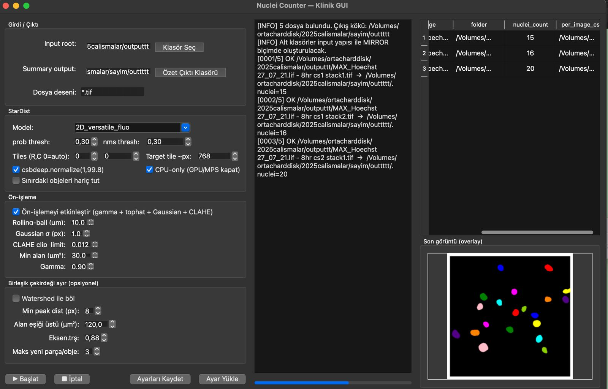
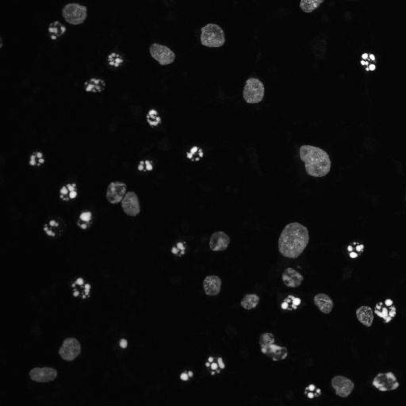
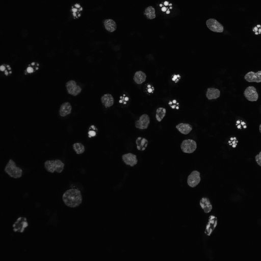
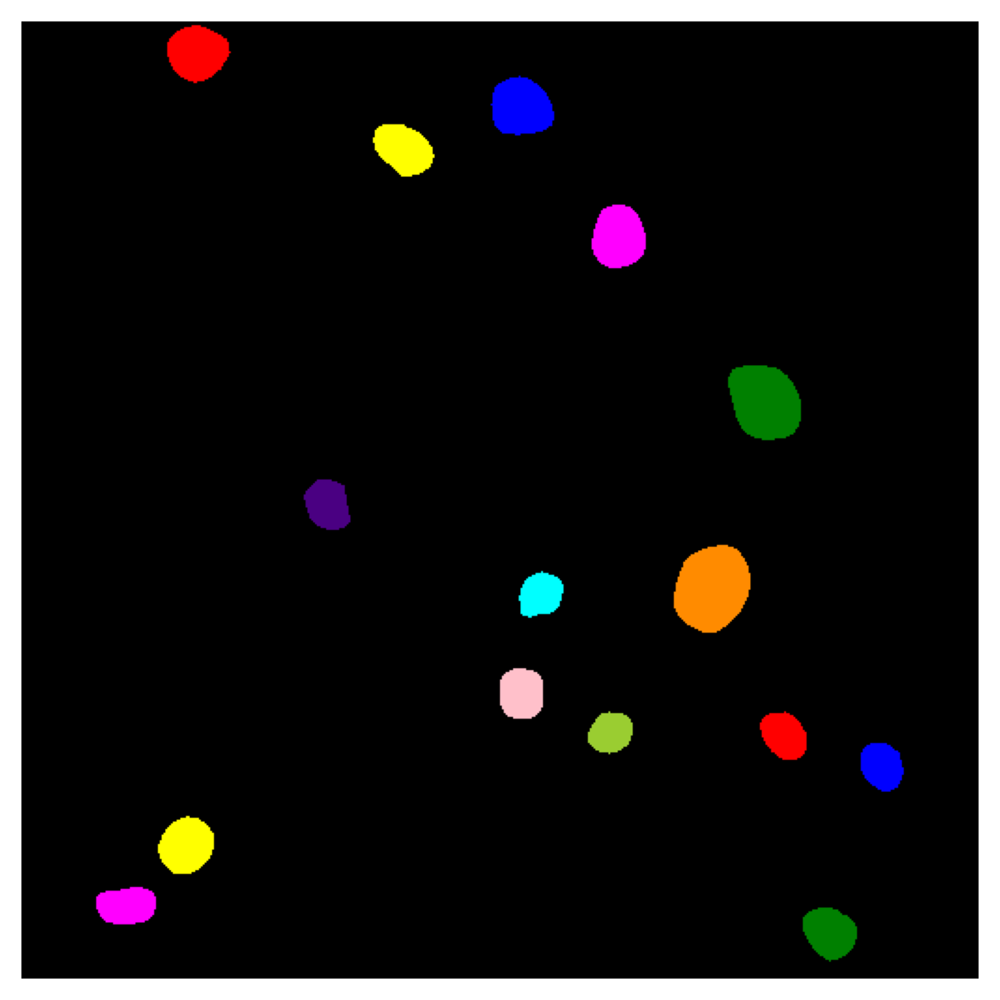
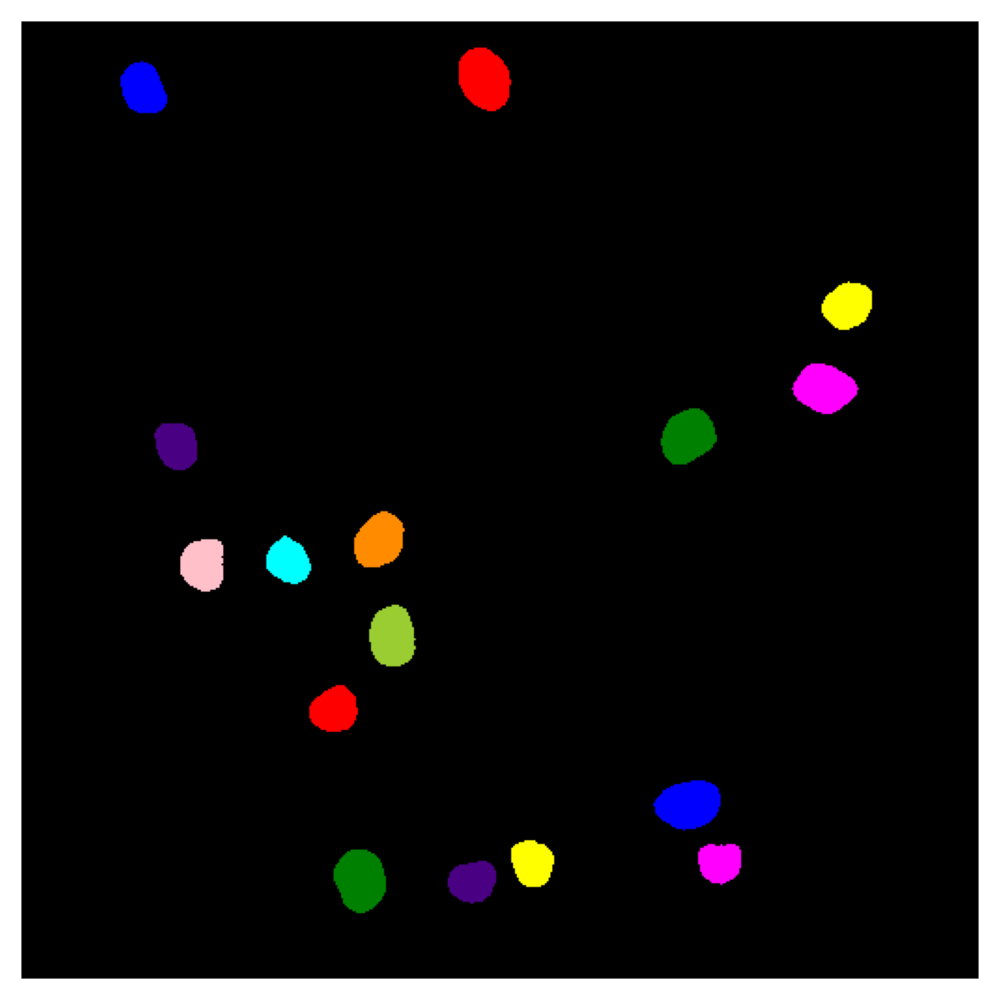
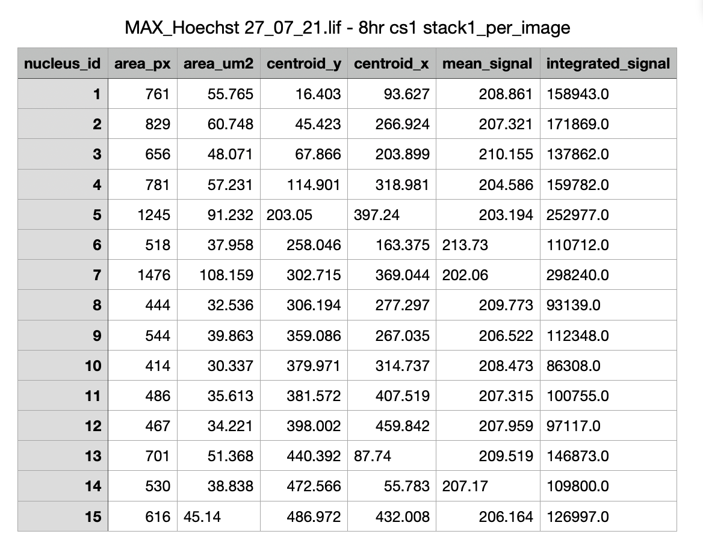
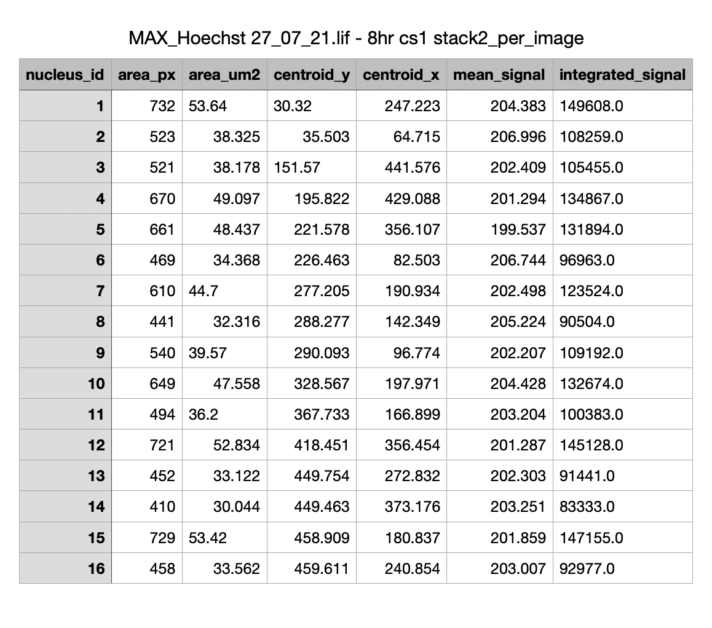

# Nuclei Counter - Clinical GUI

A PySide6-based GUI application for automated nuclei detection and counting in microscopy images using StarDist deep learning models.

## Screenshot



## Example Results

### Input Images
<p align="center">
  
  
</p>

### Output Images (with detected nuclei)
<p align="center">
  
  
</p>

## Features

- **StarDist Integration**: Deep learning-based nuclei detection using pre-trained StarDist models
- **Batch Processing**: Process multiple images with folder mirroring structure
- **Advanced Pre-processing**: Gamma correction, rolling-ball background subtraction, Gaussian filtering, CLAHE
- **Post-processing**: Watershed-based splitting of merged nuclei
- **Real-time Preview**: Live preview of detected nuclei overlay
- **Configurable Parameters**: Fine-tune detection thresholds, tiling, and processing options
- **Export Results**: CSV files with nuclei coordinates and measurements, overlay images
- **Settings Management**: Save/load processing configurations

## Requirements

```bash
pip install PySide6 numpy pandas matplotlib scikit-image tifffile aicsimageio csbdeep stardist tensorflow
```

**Note**: For GPU acceleration, install TensorFlow with CUDA support. The application also supports CPU-only mode.

## Usage

```bash
python nuclei_stardist_gui.py
```

### Quick Start

1. **Select Input Folder**: Choose folder containing microscopy images (TIFF, PNG, etc.)
2. **Select Output Folder**: Specify where to save results (optional - defaults to input_folder/output)
3. **Configure StarDist Model**: Choose pre-trained model (2D_versatile_fluo, 2D_versatile_he, etc.)
4. **Adjust Parameters**:
   - Probability threshold: Detection sensitivity (default: 0.30)
   - NMS threshold: Non-maximum suppression (default: 0.30)
   - Enable pre-processing for better results
5. **Click Start**: Process images and view results in real-time

### Pre-processing Options

- **Rolling-ball Background Subtraction**: Remove uneven background illumination (µm)
- **Gaussian Smoothing**: Reduce noise (sigma in pixels)
- **CLAHE**: Contrast enhancement (clip limit)
- **Gamma Correction**: Adjust image brightness
- **Minimum Area Filter**: Remove small artifacts (µm²)

### Post-processing (Optional)

- **Watershed Splitting**: Separate merged/touching nuclei
- **Area Threshold**: Only split large objects (µm²)
- **Eccentricity Filter**: Target elongated objects
- **Peak Distance**: Minimum distance between nuclei centers (pixels)

## Output Structure

The application mirrors your input folder structure:
```
input_folder/
  subfolder1/
    image1.tif
  subfolder2/
    image2.tif

output_folder/
  subfolder1/
    image1_nuclei_count.csv
    image1_overlay.png
  subfolder2/
    image2_nuclei_count.csv
    image2_overlay.png
```

### Output Files

- **`*_nuclei_count.csv`**: Per-image nuclei coordinates, area, and measurements
- **`*_overlay.png`**: Visual overlay of detected nuclei on original image
- **Summary table**: In-app table showing counts for all processed images

### CSV Output Examples

<p align="center">
  
  
</p>

## StarDist Models

Available pre-trained models:
- **2D_versatile_fluo**: Fluorescence microscopy (recommended for most cases)
- **2D_versatile_he**: H&E histology
- **2D_paper_dsb2018**: Custom trained models

## Dependencies

Core dependency: `nuclei_cli_stardist.py` (CLI module for image processing)

## License

MIT

## Citation

If you use StarDist in your research, please cite:
- Uwe Schmidt, Martin Weigert, Coleman Broaddus, and Gene Myers.
  *Cell Detection with Star-convex Polygons.*
  International Conference on Medical Image Computing and Computer-Assisted Intervention (MICCAI), 2018.
